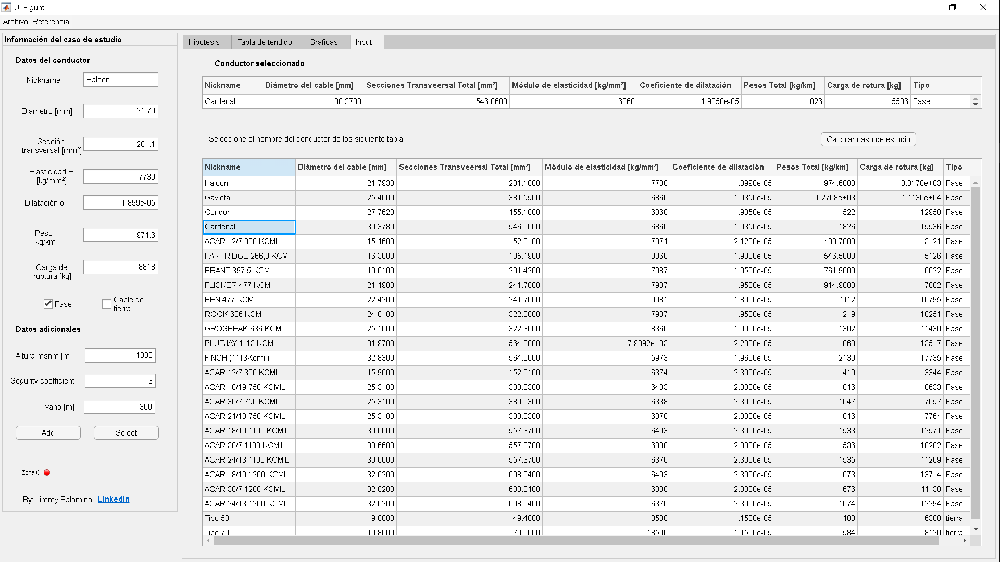
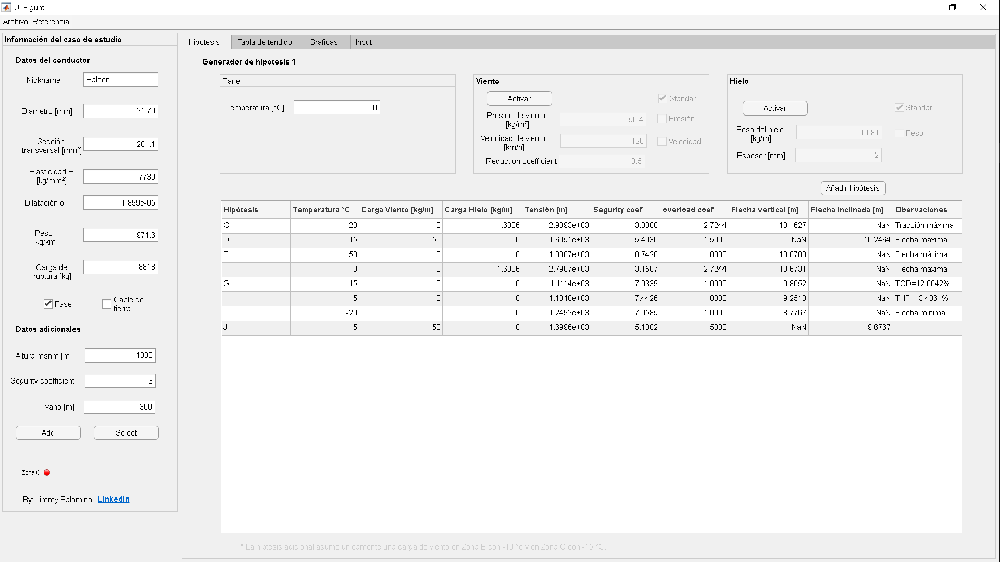
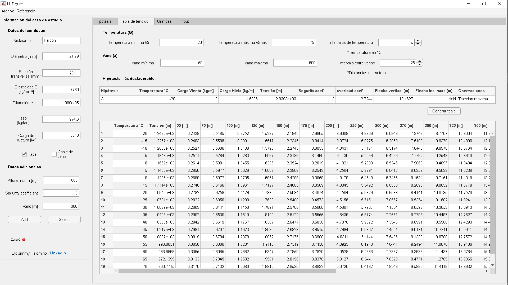
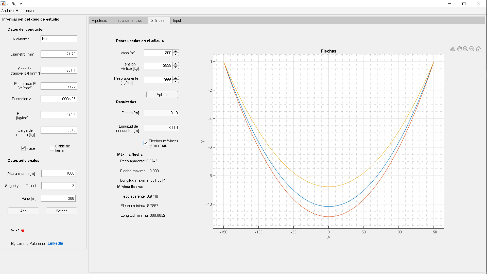

# LIMECAL

By: [Jimmy Palomino](https://www.linkedin.com/in/jimmypalomino/, 'LinkedIn')

## Description

Simulate a transmission line and know its characteristics like as the arrow, tension for different conditions: temperature, ice load, wind load and different spans.

# Input wire Data

To select a wire data click on `Select`

# Basic hypotesis simulation
Simulate for basic conditions taking account ice and wind loads.

To run click on `Add`

# Results for different spaning
This automaticaly takes worstest hypotesis and simulate its features for diferents spans.

# Catenary 
Draws the catenary. 

To run click on `Aplicar`

# Requirements
MatLab >= 2021a

# Files

## LIMECALAppDesigner 
Contains the AppDesigner file, this can be opened by:
* Typing `appdesigner` in the MatLab console.
* From the AppDesigner interface, open this file.

## LIMECALMatLab
Contains the '.m' file to use this file ony run.

# References 

This work is based on: 

Luis María Checa. "Lineas de transporte de energía". Third Edition

# Developer

Jimmy Palomino 
[LinkedIn](https://www.linkedin.com/in/jimmypalomino/)
